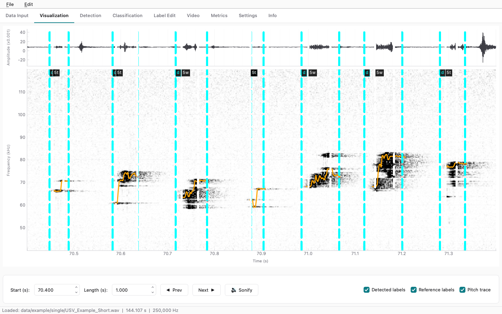

<div align="center">


# Squeak Peek Studio

**Detect, classify, review and listen to ultrasonic vocalizations (USVs) of laboratory rodents**
— a desktop application with a matching headless CLI.

[](https://github.com/antoningazda/squeak-peek-studio-releases/releases/latest)
[](https://antoningazda.github.io/squeak-peek-studio-releases/)

[](https://github.com/antoningazda/DEV_Squeak_Peek_Studio_PYTHON/actions/workflows/ci.yml)
[](pyproject.toml)
[](LICENSE)

**[⬇️ Download](https://github.com/antoningazda/squeak-peek-studio-releases/releases/latest)** ·
**[📖 Documentation](https://antoningazda.github.io/squeak-peek-studio-releases/)** ·
**[🚀 Quickstart](https://antoningazda.github.io/squeak-peek-studio-releases/quickstart/)** ·
**[⌨️ CLI](https://antoningazda.github.io/squeak-peek-studio-releases/cli/)**

<picture>
  <source media="(prefers-color-scheme: dark)" srcset="docs/assets/screenshots/visualization-dark.png">
  
</picture>

</div>

Rats and mice talk in the 40–120 kHz band, far above human hearing. Squeak
Peek Studio takes the raw high-sample-rate WAV recordings from your setup and
turns them into something you can work with: a scrollable spectrogram, a list
of detected calls, call types assigned by a trained model, an interface for
accepting or correcting each one, and audio you can hear.

Everything the GUI does, the CLI does too — a protocol developed
interactively runs unattended over a whole cohort.

## What it does

| | |
|---|---|
| 🔎 **Detect** | Five engines — PSD, BSCD, RBD, a Random Forest frame classifier and a Faster R-CNN box detector. Run several at once and compare. [Methods →](https://antoningazda.github.io/squeak-peek-studio-releases/methods/) |
| 🏷️ **Classify** | Two-stage model: a CNN separates USV from noise, a Random Forest assigns the call type and flags uncertain calls for review. [Classification →](https://antoningazda.github.io/squeak-peek-studio-releases/guide/classification/) |
| ✅ **Review** | Step through calls one key at a time, accept or reject each detection and call type, correct mistakes, export. [Label Edit →](https://antoningazda.github.io/squeak-peek-studio-releases/guide/label-edit/) |
| 🎧 **Listen** | Pitch-shifted sonification brings 70 kHz calls into your headphones; export video with the spectrogram and sonified audio. [Visualization →](https://antoningazda.github.io/squeak-peek-studio-releases/guide/visualization/) |
| 📊 **Measure** | Score any label set against reference labels — TP / FP / FN, precision, recall, F1. [Metrics →](https://antoningazda.github.io/squeak-peek-studio-releases/guide/metrics/) |
| ⚙️ **Automate** | `squeak-peek-cli` runs detection, evaluation, classification and training over single files or whole folders. [Workflows →](https://antoningazda.github.io/squeak-peek-studio-releases/workflows/) |

## Download

Standalone installers for **macOS 12+**, **Windows 10/11** and **64-bit
Linux** — no Python needed:

> **[⬇️ Get the latest release](https://github.com/antoningazda/squeak-peek-studio-releases/releases/latest)**

First launch, unsigned-build warnings and where settings are stored:
[Install guide →](https://antoningazda.github.io/squeak-peek-studio-releases/install/)

## Documentation

**<https://antoningazda.github.io/squeak-peek-studio-releases/>**

| Start here | Go deeper |
|---|---|
| [Quickstart](https://antoningazda.github.io/squeak-peek-studio-releases/quickstart/) — first detection in five minutes | [Methods](https://antoningazda.github.io/squeak-peek-studio-releases/methods/) — how each detector works and how to tune it |
| [User guide](https://antoningazda.github.io/squeak-peek-studio-releases/guide/) — every tab of the app | [Training models](https://antoningazda.github.io/squeak-peek-studio-releases/training/) — ML / CNN detectors, call-type classifier |
| [CLI reference](https://antoningazda.github.io/squeak-peek-studio-releases/cli/) — every command and option | [File formats](https://antoningazda.github.io/squeak-peek-studio-releases/file-formats/) — labels, settings, model folders |
| [CLI workflows](https://antoningazda.github.io/squeak-peek-studio-releases/workflows/) — batch recipes with runnable [examples](examples/) | [Troubleshooting](https://antoningazda.github.io/squeak-peek-studio-releases/troubleshooting/) |

## From the command line

```bash
# detect calls in one recording, dropping broadband noise
squeak-peek-cli detect recording.wav -d bscd --min-tonality 0.5

# a whole folder
squeak-peek-cli batch recordings/ -d psd -o detected/

# score against reference labels
squeak-peek-cli evaluate detected/rec01_psd_detected.txt reference/rec01.txt

# assign call types with a trained model
squeak-peek-cli classify-calls model_run/run/model results/ -r rec01.wav detected/rec01_psd_detected.txt
```

## Development

Requires Python **3.11 or 3.12**.

```bash
git clone https://github.com/antoningazda/DEV_Squeak_Peek_Studio_PYTHON.git
cd DEV_Squeak_Peek_Studio_PYTHON
python -m venv .venv && source .venv/bin/activate   # Windows: .venv\Scripts\activate
pip install -e ".[dev]"

squeak-peek          # GUI
squeak-peek-cli      # CLI
pytest               # tests
```

```
src/squeak_peek/   main package — audio/, detectors/, features/, labels/,
                   ml/, cnn/, usv_classifier/, video/, gui/
cli/               Click-based headless CLI
examples/          runnable workflow scripts
docs/              documentation site source (MkDocs Material)
settings/          default.json (shared with the MATLAB project)
packaging/         PyInstaller spec, installers, signing scripts
```

More in the [development guide](https://antoningazda.github.io/squeak-peek-studio-releases/development/).

<details>
<summary><b>Documentation site</b></summary>

The site is built from `docs/` in this repository and published to the
releases repo by `.github/workflows/docs.yml` on every push to `main`.
Preview it locally:

```bash
pip install -r docs/requirements.txt && mkdocs serve
```

</details>

<details>
<summary><b>Releases & code signing</b></summary>

Tagging `v*` builds installers for macOS, Windows and Linux and pushes them
to the public releases repo (`.github/workflows/release.yml`).

Signing is **gated on repository secrets**: with none set the workflow
produces an ad-hoc-signed `.app` (hardened runtime enabled) and an unsigned
Windows installer; with the secrets present the same workflow produces a
Developer ID-signed, notarized and stapled DMG and an Authenticode-signed
installer. Adding certificates later needs no code change.

See `packaging/SIGNING.md` for the secret names, which entitlements are
required and why, and the first-launch workaround to put in release notes
while the builds are unsigned.

</details>

## Credits

A Python reimplementation and extension of the MATLAB application developed
by **Ing. Antonín Gazda** as a Master's thesis at the **Czech Technical
University in Prague, Faculty of Electrical Engineering (FEL)** (May 2025),
in collaboration with the **National Institute of Mental Health (NUDZ)**.
[Thesis record →](https://dspace.cvut.cz/entities/publication/dede5152-081b-41cf-a4ba-55dacad884d5)

If you use Squeak Peek Studio in published work, please cite the thesis and
link this repository. Licensed under the [MIT License](LICENSE).
